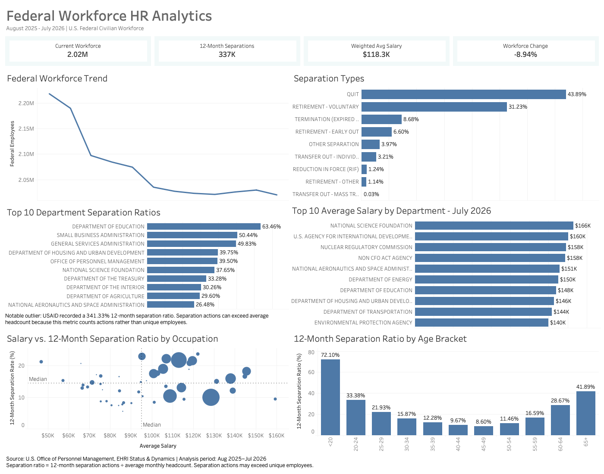

# Federal Workforce HR Analytics

An end-to-end HR analytics project analyzing U.S. federal civilian workforce trends, salaries, workforce changes, and employee separation patterns using **OPM data, Google Sheets, MySQL, and Tableau**.

## 🔗 Interactive Dashboard

### [View the Federal Workforce HR Analytics Dashboard on Tableau Public](https://public.tableau.com/app/profile/erik.villanueva1307/viz/FederalWorkforceHRAnalytics/FederalWorkforceHRDashboard)

[](https://public.tableau.com/app/profile/erik.villanueva1307/viz/FederalWorkforceHRAnalytics/FederalWorkforceHRDashboard)

---

## Project Overview

This project analyzes U.S. federal civilian workforce data from the **U.S. Office of Personnel Management (OPM)** covering the period from **August 2025 through July 2026**.

The goal of the project was to take raw public workforce data and build an end-to-end analytics workflow that could answer meaningful HR questions involving:

- Workforce size
- Workforce change
- Salaries
- Employee separations
- Separation types
- Department differences
- Occupational groups
- Age groups

The final result is an interactive Tableau dashboard backed by analytical views created in MySQL.

### Analytics Workflow

**OPM Data → Google Sheets → MySQL → Tableau → GitHub**

---

## Business Questions

This project was designed to answer the following questions:

1. How did the total federal civilian workforce change during the analysis period?
2. What percentage of the workforce was gained or lost?
3. What were the most common types of employee separations?
4. Which departments experienced the highest separation ratios?
5. Which departments reported the highest average salaries?
6. How do salary and separation patterns differ across occupational groups?
7. How do separation ratios differ across age groups?
8. Is there a relationship between occupational salary levels and separation activity?

---

## Tools & Technologies

| Tool | Purpose |
|---|---|
| **Google Sheets** | Initial cleaning, reshaping, validation, and preparation of exported OPM data |
| **MySQL** | Data storage, joins, aggregation, calculations, validation, and analytical views |
| **MySQL Workbench** | SQL development and database management |
| **Tableau Desktop** | Dashboard development and data visualization |
| **Tableau Public** | Publishing and sharing the interactive dashboard |
| **GitHub** | Project documentation and SQL portfolio |

---

## Data Preparation

The original OPM tables were exported in a wide-format structure that was not ideal for SQL analysis.

The data was cleaned and reshaped in Google Sheets before being loaded into MySQL.

### Cleaning Steps

The preparation process included:

- Restructuring wide tables into row-based analytical datasets
- Converting OPM monthly values into usable dates
- Standardizing department names
- Standardizing occupational group labels
- Standardizing age brackets
- Separating employment data from separation data
- Checking row counts
- Checking unique categories
- Identifying missing values
- Preserving legitimate `NULL` salary values
- Validating totals before analysis
- Checking date ranges across datasets
- Comparing employment and separation categories before joining tables

The cleaned data was loaded into a MySQL database named:

```sql
federal_hr_analytics
```

---

## Database Structure

The project used several analytical tables representing different dimensions of the federal workforce.

Examples include:

```text
employment_department_monthly
separations_department_monthly

employment_occupation_monthly
separations_occupation_monthly

employment_age_monthly
separations_age_monthly

separations_type_department
```

These tables allowed employment and separation activity to be analyzed by:

- Month
- Department
- Occupational group
- Separation type
- Age bracket

---

## SQL Analysis

MySQL was used to transform the cleaned datasets into reusable analytical views for Tableau.

The complete SQL file is available here:

### [`sql/federal_workforce_analysis.sql`](sql/federal_workforce_analysis.sql)

### SQL Skills Demonstrated

The project uses:

- `SELECT`
- `WHERE`
- `ORDER BY`
- `GROUP BY`
- `HAVING`
- `INNER JOIN`
- `CROSS JOIN`
- `CASE`
- Subqueries
- Aggregate functions
- `SUM()`
- `AVG()`
- `MIN()`
- `MAX()`
- `ROUND()`
- `NULLIF()`
- Weighted averages
- Conditional logic
- SQL views
- Data validation queries
- KPI calculations

---

## Tableau-Ready SQL Views

Several SQL views were created specifically to simplify Tableau development.

### `vw_dashboard_kpis`

Provides the main dashboard KPI values:

- Latest workforce size
- Weighted average salary
- Total separation actions
- Starting workforce size
- Workforce change
- Workforce change percentage

### `vw_monthly_workforce_trend`

Provides:

- Monthly total employee count
- Monthly weighted average salary

This view powers the federal workforce trend chart.

### `vw_department_latest_snapshot`

Provides the latest available department-level:

- Employee count
- Average salary

This view is used for the latest department salary comparison.

### `vw_department_separation_rates`

Calculates department-level separation ratios using:

```text
12-Month Separation Actions
---------------------------- × 100
Average Monthly Headcount
```

### `vw_separation_type_distribution`

Calculates the distribution of separation actions by type.

Examples include:

- Quit
- Voluntary retirement
- Early retirement
- Termination
- Reduction in Force
- Transfers
- Other separation

### `vw_occupation_analytics`

Combines occupational employment and separation data to analyze:

- Average salary
- Average employee count
- Total separation actions
- Separation ratio
- Employee-size threshold

This view powers the salary-versus-separation scatter plot.

### `vw_age_separation_rates`

Calculates separation ratios by age bracket and creates a custom age-order field so Tableau displays age groups chronologically instead of alphabetically.

---

## KPI Results

The dashboard summarizes the workforce using four primary KPIs.

| KPI | Result |
|---|---:|
| Current Workforce | **2.02M** |
| 12-Month Separation Actions | **337K** |
| Weighted Average Salary | **$118.3K** |
| Workforce Change | **-8.94%** |

The workforce decreased from approximately **2.22 million employees to 2.02 million employees** during the analysis period.

---

## Key Findings

### 1. Federal workforce headcount declined

Federal civilian employment decreased from approximately **2.22M employees** to **2.02M employees**, representing an overall workforce change of **-8.94%**.

The largest decline occurred earlier in the analysis period, followed by a more stable workforce level during later months.

### 2. Quits were the largest separation category

The largest separation category was:

```text
QUIT — 43.89%
```

Voluntary retirement was the second-largest category:

```text
RETIREMENT - VOLUNTARY — 31.23%
```

Together, quits and voluntary retirements accounted for the majority of recorded separation actions.

### 3. Separation activity varied significantly by department

Departments showed substantial differences in their 12-month separation ratios.

Among the departments displayed in the dashboard, some of the highest ratios included:

```text
Department of Education          63.46%
Small Business Administration    50.44%
General Services Administration  49.83%
```

This shows that separation activity was not evenly distributed across the federal workforce.

---

## Important Separation Ratio Note

This project uses a **separation ratio**, not a traditional unique-employee turnover rate.

The calculation is:

```text
12-Month Separation Actions
----------------------------
Average Monthly Headcount
```

Because the OPM dataset records **personnel actions rather than unique employees**, the number of separation actions can exceed average headcount.

For this reason, a separation ratio may exceed **100%**.

A notable example is:

```text
U.S. Agency for International Development
12-Month Separation Ratio: 341.33%
```

USAID was treated as an outlier in the main department comparison visualization so the remaining departments could be compared clearly.

The outlier is still disclosed directly on the dashboard.

### 4. Department salaries varied considerably

The latest department salary snapshot showed substantial salary differences across federal organizations.

Some of the highest average salaries included approximately:

```text
National Science Foundation                  $166K
U.S. Agency for International Development   $160K
Nuclear Regulatory Commission               $158K
Non CFO Act Agency                           $158K
NASA                                         $151K
```

### 5. Occupational groups showed different salary and separation patterns

A scatter plot was created comparing:

```text
Average Salary
vs.
12-Month Separation Ratio
```

Each bubble represents an occupational group.

Bubble size represents average workforce size.

The chart also includes median reference lines, dividing occupations into four analytical groups:

```text
Higher Salary / Higher Separation
Higher Salary / Lower Separation
Lower Salary / Higher Separation
Lower Salary / Lower Separation
```

This provides a quick way to identify occupational groups that differ from the overall workforce pattern.

### 6. Age groups showed a U-shaped separation pattern

Separation ratios were highest among the youngest and oldest age groups.

| Age Group | Separation Ratio |
|---|---:|
| <20 | **72.10%** |
| 20–24 | **33.38%** |
| 25–29 | **21.93%** |
| 30–34 | **15.87%** |
| 35–39 | **12.28%** |
| 40–44 | **9.67%** |
| 45–49 | **8.60%** |
| 50–54 | **11.46%** |
| 55–59 | **16.59%** |
| 60–64 | **28.67%** |
| 65+ | **41.89%** |

The lowest separation ratio occurred among employees aged **45–49**.

The pattern then increased again among older workers, which is consistent with greater retirement activity near the end of employees' careers.

---

## Tableau Dashboard

The final Tableau dashboard includes:

### KPI Cards

- Current Workforce
- 12-Month Separations
- Weighted Average Salary
- Workforce Change

### Workforce Trend

Shows monthly federal workforce headcount from August 2025 through July 2026.

### Separation Types

Displays the percentage distribution of separation actions.

### Top Department Separation Ratios

Compares departments with the highest separation ratios.

### Top Average Salaries by Department

Shows departments with the highest average salary during the latest available snapshot.

### Salary vs. Separation Ratio by Occupation

Uses a bubble scatter plot to compare occupational groups by:

- Average salary
- Separation ratio
- Average employee count

Median reference lines provide additional context.

### Separation Ratio by Age Bracket

Shows how separation activity changes across employee age groups.

---

## Dashboard Preview

[](https://public.tableau.com/app/profile/erik.villanueva1307/viz/FederalWorkforceHRAnalytics/FederalWorkforceHRDashboard)

### [View Interactive Dashboard on Tableau Public](https://public.tableau.com/app/profile/erik.villanueva1307/viz/FederalWorkforceHRAnalytics/FederalWorkforceHRDashboard)

---

## Repository Structure

```text
federal-workforce-hr-analytics/
│
├── assets/
│   └── dashboard-preview.png
│
├── sql/
│   └── federal_workforce_analysis.sql
│
└── README.md
```

---

## Data Source

Data for this project comes from the:

**U.S. Office of Personnel Management (OPM)**

Enterprise Human Resources Integration:

```text
EHRI Status
EHRI Dynamics
```

The analysis covers:

```text
August 2025 – July 2026
```

The data represents the U.S. federal civilian workforce.

---

## Methodology

### Weighted Average Salary

Rather than simply averaging department salaries, the project calculates a weighted average based on employee counts.

Conceptually:

```text
Σ(Average Salary × Employee Count)
---------------------------------
Σ(Employee Count)
```

This prevents small departments and large departments from contributing equally to the overall salary estimate.

### Workforce Change

Workforce change was calculated as:

```text
Latest Workforce - Starting Workforce
```

Percentage change:

```text
Latest Workforce - Starting Workforce
------------------------------------- × 100
Starting Workforce
```

### Separation Ratio

The project defines the 12-month separation ratio as:

```text
Total Separation Actions
------------------------ × 100
Average Monthly Headcount
```

This is an activity-based workforce metric and should not be interpreted as the percentage of unique employees who left.

---

## Project Challenges

Several issues required additional validation during the project.

### Wide-Format OPM Exports

The source tables were structured more like pivot tables than analysis-ready datasets.

They had to be reshaped before loading into MySQL.

### Missing Values

Some categories contained missing values or `NULL` salary information.

Valid missing salary values were preserved instead of being replaced with misleading values.

### Category Mismatches

Employment and separation datasets did not always contain identical category lists.

Categories were checked before SQL joins were created.

### Separation Ratios Above 100%

Because separation records represent personnel actions rather than unique employees, some ratios exceeded 100%.

This required careful metric naming and dashboard documentation.

---

## Skills Demonstrated

### SQL

- Joins
- Aggregations
- Subqueries
- Views
- Conditional logic
- Weighted averages
- KPI calculations
- Data validation
- Null handling

### Data Cleaning

- Data reshaping
- Date conversion
- Category standardization
- Missing-value handling
- Row-count validation
- Data-quality checks

### Tableau

- KPI cards
- Line charts
- Horizontal bar charts
- Bubble scatter plots
- Reference lines
- Tooltips
- Filters
- Top-N analysis
- Dashboard containers
- Dashboard formatting
- Tableau extracts
- Tableau Public publishing

### Analytical Skills

- HR analytics
- Workforce analysis
- Salary analysis
- Separation analysis
- Trend analysis
- Outlier identification
- Data validation
- Data storytelling

---

## Project Files

### SQL Analysis

[`sql/federal_workforce_analysis.sql`](sql/federal_workforce_analysis.sql)

### Dashboard Preview

[`assets/dashboard-preview.png`](assets/dashboard-preview.png)

### Interactive Tableau Dashboard

[Open Dashboard](https://public.tableau.com/app/profile/erik.villanueva1307/viz/FederalWorkforceHRAnalytics/FederalWorkforceHRDashboard)

---

## Author

**Erik Villanueva Gomez**

Aspiring Data Analyst focused on developing practical skills in:

**SQL · Tableau · Excel/Google Sheets · Data Cleaning · Data Visualization · Business Analytics**

---

## Future Improvements

Possible future extensions of this project include:

- Adding geographic workforce analysis
- Comparing federal agencies by occupation
- Adding agency-level age distributions
- Analyzing additional years of historical OPM data
- Building year-over-year comparisons
- Adding additional workforce demographic dimensions
- Automating the data-cleaning workflow
- Creating a Python version of the analysis
